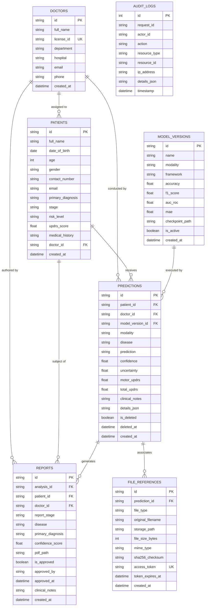

# NeuroFusionAI – Database Entity-Relationship (ER) Diagram

**System**: NeuroFusionAI Relational Schema  
**Database**: Neon Cloud PostgreSQL  
**Generated**: 2026-11-02  

---

```mermaid
erDiagram
    DOCTORS ||--o{ PATIENTS : "assigned to"
    DOCTORS ||--o{ PREDICTIONS : "conducted by"
    DOCTORS ||--o{ REPORTS : "authored by"
    
    PATIENTS ||--o{ PREDICTIONS : "receives"
    PATIENTS ||--o{ REPORTS : "subject of"
    
    MODEL_VERSIONS ||--o{ PREDICTIONS : "executed by"
    
    PREDICTIONS ||--o{ REPORTS : "generates"
    PREDICTIONS ||--o{ FILE_REFERENCES : "associates"
    
    DOCTORS {
        string id PK
        string full_name
        string license_id UK
        string department
        string hospital
        string email
        string phone
        datetime created_at
    }

    PATIENTS {
        string id PK
        string full_name
        date date_of_birth
        int age
        string gender
        string contact_number
        string email
        string primary_diagnosis
        string stage
        string risk_level
        float updrs_score
        string medical_history
        string doctor_id FK
        datetime created_at
    }

    MODEL_VERSIONS {
        string id PK
        string name
        string modality
        string framework
        float accuracy
        float f1_score
        float auc_roc
        float mae
        string checkpoint_path
        boolean is_active
        datetime created_at
    }

    PREDICTIONS {
        string id PK
        string patient_id FK
        string doctor_id FK
        string model_version_id FK
        string modality
        string disease
        string prediction
        float confidence
        float uncertainty
        float motor_updrs
        float total_updrs
        string clinical_notes
        string details_json
        boolean is_deleted
        datetime deleted_at
        datetime created_at
    }

    REPORTS {
        string id PK
        string analysis_id FK
        string patient_id FK
        string doctor_id FK
        string report_stage
        string disease
        string primary_diagnosis
        float confidence_score
        string pdf_path
        boolean is_approved
        string approved_by
        datetime approved_at
        string clinical_notes
        datetime created_at
    }

    FILE_REFERENCES {
        string id PK
        string prediction_id FK
        string file_type
        string original_filename
        string storage_path
        int file_size_bytes
        string mime_type
        string sha256_checksum
        string access_token UK
        datetime token_expires_at
        datetime created_at
    }

    AUDIT_LOGS {
        int id PK
        string request_id
        string actor_id
        string action
        string resource_type
        string resource_id
        string ip_address
        string details_json
        datetime timestamp
    }
```

